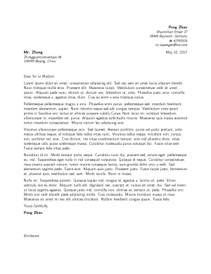
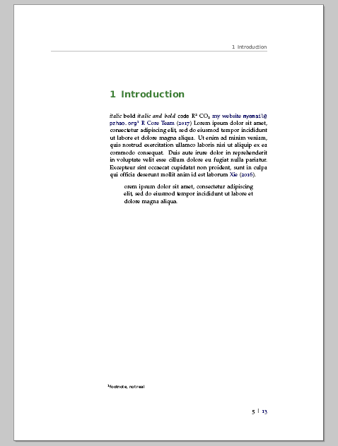
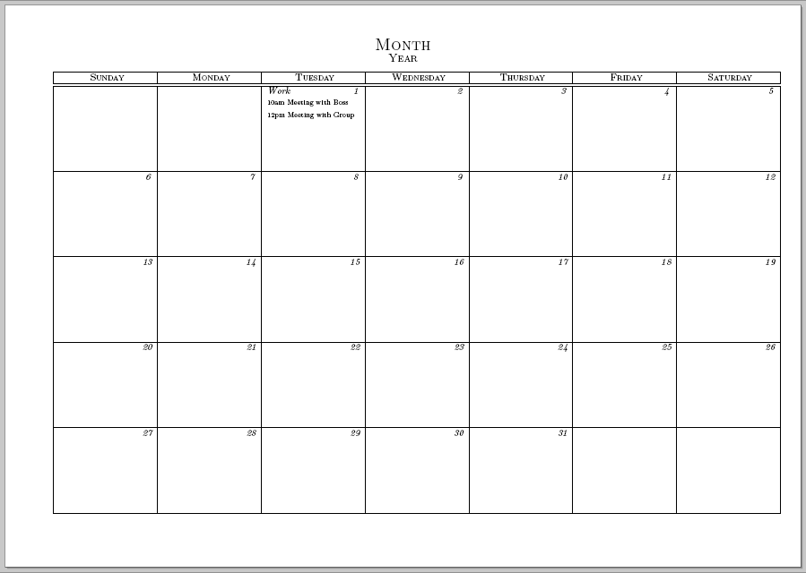
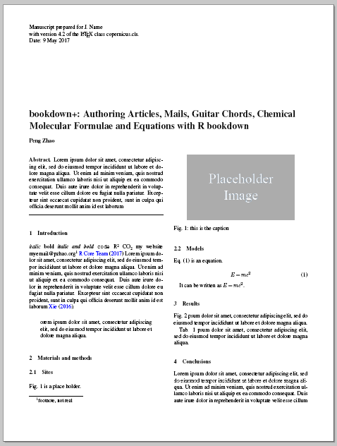
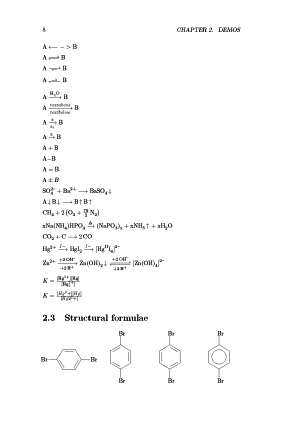

<div class="container-fluid main-container">

<div id="header" class="fluid-row">

R bookdown+: Writing Articles, Mails, Guitar Chords, Chemical Molecular Formulae and Equations with R bookdown
==============================================================================================================

#### *Peng Zhao*

</div>

<div id="introduction" class="section level1">

Introduction
============

`bookdown+`? Hmm…sounds like something related to the R<span
class="citation">(R Core Team 2017)</span> package `bookdown` <span
class="citation">(Xie 2016)</span>?

Yes, you ***R*** right. Everyone knows that `bookdown` is an excellent
package for authoring books on programming languages. But it is only one
side of the coin. It can do more than expected. `bookdown` smells like a
tasty cake. I have been expecting someone to cut it. Now I am helping
myself. Therefore I am developing `bookdown+`.

`bookdown+` is an extension of `bookdown`. It is a collection of
multiple templates, which I collected years ago on the basis of <span
class="math inline">\\(\\LaTeX\\)</span>, and have been tailoring them
so that I can work happily under the umbrella of `bookdown`. `bookdown+`
shows you the other side of the coin, which helps you write academic
journal articles, guitar books, chemical equations, mails, calendars,
and diaries.

I believe some official bookdown templates will be available in the near
future, but I cannot wait. Can you?

</div>

<div id="features" class="section level1">

Features
========

With `bookdown+` you can

-   record guitar chords,

-   write a mail in an elegant layout,

-   write a laboratory journal, or a personal diary,

-   draw a monthly or weekly or conference calendar,

-   and, of course, write academic articles in your favourite way,

-   with chemical molecular formulae and equations,

-   even in Chinese,

-   and more wonders will come soon.

</div>

<div id="quick-start" class="section level1">

Quick start
===========

<div id="step-0.-preparation" class="section level2">

Step 0. Preparation
-------------------

Before starting, you have to install R, RStudio, bookdown package, and
other software and packages (i.e. `Pandoc`, <span
class="math inline">\\(\\LaTeX\\)</span>, `rmarkdown`, `rticle`,
`knitr`, etc.) which bookdown depends on. See the official manual of
bookdown[^1^](#fn1){#fnref1 .footnoteRef} for details.

If you are ready, [download
`bookdown+`](https://github.com/dapengde/bookdown-plus/archive/master.zip)
package as a zip file from Github. Unzip it to a folder in your PC. You
will find a file named `_start.Rproj`. Double click it, and it will be
opened by RStudio.

OK, now you can see a `_runme.R` file as well. Open it and run the
script, or follow my explanation as follows,

</div>

<div id="step-1.-title-and-author" class="section level2">

Step 1. Title and author
------------------------

Specify the title and the author of your book, article, guitar book, or
whatever.

``` {.r}
title <- 'R bookdown+: Authoring Articles, Mails, Guitar books, Chemical Molecular Formulae and Equations with R bookdown'
author <- 'Peng Zhao'
```

</div>

<div id="step-2-template" class="section level2">

Step 2: Template
----------------

Choose a template out of the available templates. Here I choose the 8th.

``` {.r}
templates  <- c('article',     #1, academic article
                'article_zh',  #2, academic article in Chinese
                'calendar',    #3, calendar, in progress
                'chemistry',   #4, chemical molecular formulae and equations
                'chemistry_zh',#5, in Chinese,
                'guitar',      #6, guitar book
                'mail',        #7, mail, in progress
                'journal',     #8, laboratory journal, or personal diary
                'mini',        #9, a mini demo by Yihui
                'original',    #10, the original demo by Yihui
                'book_zh'      #11, the demo in Chinese by Yihui
)
template <- templates[8]
```

If you choose the template `mail`, you have to clarify the information
of the sender and receiver.

``` {.r}
from_who <- author
from_address <- 'Maximillian Street 27'
from_town <- '95440 Bayreuth, Germany'
from_phone <- '62762524'
from_email <- 'dapengde@live.com'
towho <- 'CAMS'
to_address <- 'Zhongguancunnandajie 46'
to_town <- '100000 Beijing, China'
```

Run `fun/build.R`:

``` {.r}
source('fun/build.R')
```

</div>

<div id="step-3-write-and-build" class="section level2">

Step 3: Write and Build
-----------------------

Now you can press `ctrl+shift+b` to build a demo book, which you can
find in `book/`.

Write your own text in `body.Rmd`, and build your own lovely book.

Have fun!

</div>

</div>

<div id="citations" class="section level1">

Citations
=========

`bookdown+` is developed on the basis of the following outstanding work:

-   R bookdown package <span class="citation">(Xie 2016)</span>
-   Two minimal book examples using bookdown by Yihui
    Xie[^2^](#fn2){#fnref2 .footnoteRef}[^3^](#fn3){#fnref3
    .footnoteRef}
-   gchords, a LaTeX package for typesetting guitar chord diagrams by
    Kasper Peeters[^4^](#fn4){#fnref4 .footnoteRef}
-   Copernicus Publications LaTeX Package[^5^](#fn5){#fnref5
    .footnoteRef}

If I miss something that I should cite, please let me know.

</div>

<div id="updates" class="section level1">

Updates
=======

-   2017-05-09, Version 0.1. A very preliminary version.

</div>

<div id="to-do" class="section level1">

To do
=====

-   thesis template (en and zh)

-   peom book template

-   cv template

-   write a book introducing bookdown+

</div>

<div id="showcase" class="section level1">

Showcase
========













</div>

<div id="references" class="section level1 unnumbered">

References
==========

<div id="refs" class="references">

<div id="ref-R-base">

R Core Team. 2017. *R: A Language and Environment for Statistical
Computing*. Vienna, Austria: R Foundation for Statistical Computing.
<https://www.R-project.org/>.

</div>

<div id="ref-R-bookdown">

Xie, Yihui. 2016. *Bookdown: Authoring Books and Technical Documents
with R Markdown*. <https://github.com/rstudio/bookdown>.

</div>

</div>

</div>

<div class="footnotes">

------------------------------------------------------------------------

1.  <div id="fn1">

    </div>

    <https://bookdown.org/yihui/bookdown/>[↩](#fnref1)

2.  <div id="fn2">

    </div>

    <https://github.com/yihui/bookdown-minimal>[↩](#fnref2)

3.  <div id="fn3">

    </div>

    <https://github.com/rstudio/bookdown-demo>[↩](#fnref3)

4.  <div id="fn4">

    </div>

    <http://kasper.phi-sci.com/gchords/>[↩](#fnref4)

5.  <div id="fn5">

    </div>

    <http://publications.copernicus.org/for_authors/latex_instructions.html>[↩](#fnref5)

</div>

</div>
