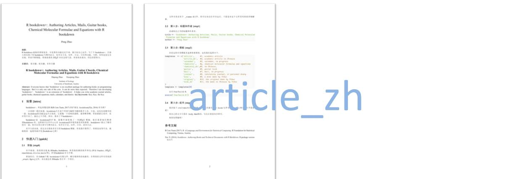
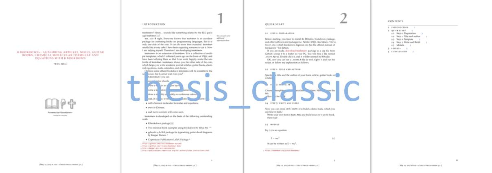

R bookdown+: Writing Articles, Mails, Guitar Chords, Chemical Molecular Formulae and Equations with R bookdown
==============================================================================================================

#### *Peng Zhao*

# Introduction

`R bookdown+` is an extension of `R bookdown` (Xie 2016). It is a collection of
multiple templates on the basis of LaTeX, which are tailored so that I can work happily under the umbrella of `bookdown`. `R bookdown+` helps you write academic journal articles, guitar books, chemical equations, mails, calendars, and diaries.

# Features

`R bookdown+` extends the features of `bookdown`, and simplifies the procedure. Users only have to choose a template, clarify the book title and author name, and then focus on writing the text. No need to struggle in YAML and LaTeX. 

With `R bookdown+` users can

-   record guitar chords,
-   write a mail in an elegant layout,
-   write a laboratory journal, or a personal diary,
-   draw a monthly or weekly or conference calendar,
-   and, of course, write academic articles in your favourite way,
-   with chemical molecular formulae and equations,
-   even in Chinese,
-   and more wonders will come soon.

Full documentation can be found in the book [R bookdown+ Textbook](https://bookdown.org/baydap/bookdown-plus). The webpage looks so-so, while the [pdf file](https://bookdown.org/baydap/bookdown-plus/bookdown-plus.pdf) might give you a little surprise.  

# Quick start

This is a 3-step quick start. Although this section might not be the latest version, the general idea won't change. Please see [R bookdown+ Textbook](https://bookdown.org/baydap/bookdown) to keep up with the update.

## Preparation

Before starting, you have to install R, RStudio, bookdown package, and
other software and packages (i.e. Pandoc, LaTeX, rmarkdown, rticle,
knitr, etc.) which bookdown depends on. See the official [manual](https://bookdown.org/yihui/bookdown/) of
bookdown for details.

If you are ready, [download
`R bookdown+`](https://github.com/dapengde/bookdown-plus/archive/master.zip)
package as a zip file from Github. Unzip it to a folder in your PC. You
will find a file named `_start.Rproj`. Double click it, and it will be
opened by RStudio.

OK, now you can see a `_runme.R` file as well. Open it and run the
script, or follow my explanation as follows,

## Step 1. Title and author

Specify the title and the author of your book, article, guitar book, or
whatever.

``` {.r}
title <- 'R bookdown+: Authoring Articles, Mails, Guitar books, Chemical Molecular Formulae and Equations with R bookdown'
author <- 'Peng Zhao'
```

## Step 2: Template

Choose a template out of the available templates. Here I choose the 8th.

``` {.r}
templates  <- c('article',     #1, academic article
                'article_zh',  #2, academic article in Chinese
                'calendar',    #3, calendar, in progress
                'chemistry',   #4, chemical molecular formulae and equations
                'chemistry_zh',#5, in Chinese,
                'guitar',      #6, guitar book
                'mail',        #7, mail, in progress
                'journal',     #8, laboratory journal, or personal diary
                'mini',        #9, a mini demo by Yihui
                'original',    #10, the original demo by Yihui
                'book_zh'      #11, the demo in Chinese by Yihui
)
template <- templates[8]
```

If you choose the template `mail`, you have to clarify the information
of the sender and receiver.

``` {.r}
from_who <- author
from_address <- 'Maximillian Street 27'
from_town <- '95440 Bayreuth, Germany'
from_phone <- '62762524'
from_email <- 'dapengde@live.com'
towho <- 'CAMS'
to_address <- 'Zhongguancunnandajie 46'
to_town <- '100000 Beijing, China'
```

Run `fun/build.R`:

``` {.r}
source('fun/build.R')
```

## Step 3: Write and Build

Now you can press `ctrl+shift+b` to build a demo book, which you can
find in `book/`.

Write your own text in `body.Rmd`, and build your own lovely book.

Have fun!


## Showcase

- article


- article_mdpi1

   







## Updates
- 2017-05-14. **Version 0.3.1**: New template available: poster.
- 2017-05-12. **Version 0.3.0**: Some more template.
- 2017-05-11. **Version 0.2.0**: One more template, license, new readme. **R bookdown+ Textbook** started.
- 2017-05-09. **Version 0.1.0**. A very preliminary version.

## To do

-   cv template

# License

Copyright 2017 [Peng Zhao](http://pzhao.org).

Released under the [MIT](https://github.com/dapengde/bookdown-plus/blob/master/LICENSE.md) license.